# AgriMANET-Scheduler: Priority-Aware Packet Scheduling for Off-Grid Smart Agriculture

## 1. Executive Research Overview
Digital agriculture frameworks routinely fail in remote, smallholder farming regions due to a severe **Infrastructure Deficit** (such as a total lack of 4G/5G cellular coverage or high operational data transmission costs). While Mobile Ad-Hoc Networks (MANETs) provide an alternative by routing localized parameters peer-to-peer across moving nodes (e.g., agricultural field agents, automated crop drones, and farmers' mobile handsets), traditional setups manage data blindly using a generic, best-effort approach.

`AgriMANET-Scheduler` addresses this specific limitation. It introduces an advanced, data-aware **Cross-Layer Weighted Round Robin (WRR) Scheduling Algorithm** that analyzes payload parameters directly at the ingress buffer. This ensures that time-sensitive agricultural indicators (such as high-priority locust tracking vectors or sudden crop blight anomalies) clear network bottlenecks instantly, while non-urgent routines (such as generic, historical soil moisture logs) are deferred systematically to manage link capacity.

This repository serves as an open-source technical proof-of-concept supporting my formal research proposal for the Japanese Government (MEXT) Master's scholarship program.

---

## 2. Algorithmic Architecture & System Constraints

The scheduler coordinates an active multi-queue configuration mapping distinct metadata packages directly into dedicated transmission tracks based on urgent priority metrics ($P$):

$$\text{Priority } (P) = \begin{cases} 
3 & \text{Critical Intelligence (Pest Outbreaks, Disease Transmission Vector Updates)} \\
2 & \text{Logistical / Market Telemetry (Real-time Crop Value, Distribution Path Dynamics)} \\
1 & \text{Routine Field Telemetry (Static Soil Compaction Logs, Standard Weather Metric Bundles)} 
\end{cases}$$

### Transmission Strategy (Weighted Round Robin)
To prevent network stalling while ensuring total Quality of Service (QoS) guarantees for highly critical payloads, the transmission cycle enforces a strict **$5:3:1$ dynamic execution ratio** across class queues ($Q_3, Q_2, Q_1$). 

```mermaid
flowchart TD
    %% Define Nodes
    Ingress([Heterogeneous Data Ingress])
    
    Parsing[Data Type Parsing &<br>Class Assignment]
    
    subgraph Buffering [Priority Buffering Layer]
        P3[P = 3]
        P2[P = 2]
        P1[P = 1]
    end
    
    subgraph Queues [Dedicated Class Queues]
        Q3[Q3]
        Q2[Q2]
        Q1[Q1]
    end
    
    Scheduler[Dynamic Packet<br>Selection Scheduler]
    
    Egress([Single Egress Wireless Channel])

    %% Define Connections & Ratios
    Ingress --> Parsing
    
    Parsing --> P3
    Parsing --> P2
    Parsing --> P1
    
    P3 --> Q3
    P2 --> Q2
    P1 --> Q1
    
    Q3 -- "Token Ratio: 5x" --> Scheduler
    Q2 -- "Token Ratio: 3x" --> Scheduler
    Q1 -- "Token Ratio: 1x" --> Scheduler
    
    Scheduler --> Egress

    %% Custom Styling
    style Ingress fill:#1f6feb,stroke:#58a6ff,stroke-width:2px,color:#fff
    style Egress fill:#1f6feb,stroke:#58a6ff,stroke-width:2px,color:#fff
    style Parsing fill:#21262d,stroke:#30363d,stroke-width:1px
    style Scheduler fill:#21262d,stroke:#30363d,stroke-width:1px
```



During a single scheduling round, the controller attempts to clear up to 5 packets from Q₃, 3 packets from Q₂, and 1 packet from Q₁. If a queue runs dry mid-cycle, tokens are immediately yielded back to the higher classes, optimizing overall link-state capacity dynamically.

---

## 3. Implementation Standards & Code Layout

This simulation engine is developed natively in Python using production-grade Object-Oriented Programming (OOP) paradigms, strict static type hinting, and robust memory-efficient queueing data architectures.

### System Prerequisites
* Python 3.10 or higher
* No external third-party dependencies are required (built purely via native `queue` and `typing` libraries).

### Verification and Execution Commands
Clone the repository and trigger the network simulation testbench locally:

```bash
# Clone this optimization repository
git clone https://github.com

# Navigate into the deployment directory
cd AgriMANET-Scheduler

# Execute the core transmission engine simulation
python scheduler.py
```

---

## 4. Expected System Transmission Logs

When executed, the system displays data classifications clearing queues in order of critical priority weights:

```text
=== Initializing Agri-MANET Optimization Simulation ===

-> Ingress: [Packet 101 | Soil Moisture Log | Priority: 1] buffered successfully.
-> Ingress: [Packet 102 | Locust Swarm Alert | Priority: 3] buffered successfully.
-> Ingress: [Packet 103 | Market Price Update | Priority: 2] buffered successfully.
-> Ingress: [Packet 104 | Blight Outbreak Vector | Priority: 3] buffered successfully.
-> Ingress: [Packet 105 | Weather Forecast Broadcast | Priority: 2] buffered successfully.

=== Executing Data-Aware Packet Scheduling Cycle ===

Optimized Transmission Order (High-Priority AI Metrics First):
Slot 1: [Packet 102 | Locust Swarm Alert | Priority: 3]
Slot 2: [Packet 104 | Blight Outbreak Vector | Priority: 3]
Slot 3: [Packet 103 | Market Price Update | Priority: 2]
Slot 4: [Packet 105 | Weather Forecast Broadcast | Priority: 2]
Slot 5: [Packet 101 | Soil Moisture Log | Priority: 1]
```

---

## 5. Academic Roadmap (Proposed Extensions in Japan)
For my upcoming Master’s thesis research in Japan, I plan to integrate this high-level logic layer into advanced lower-level frameworks:
1. **Discrete Event Simulation**: Porting this prioritization framework into **NS-3 (Network Simulator 3)** using C++ to measure exact end-to-end packet delivery delays and jitter percentages.
2. **Mobility Integration**: Testing link sustainability under complex spatial constraints by feeding real-world agricultural transport routes and drone trajectories into the dynamic routing logic.
